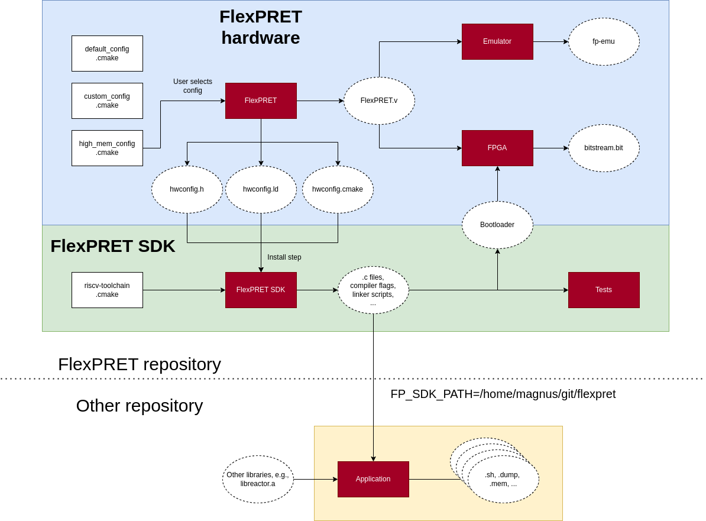

FlexPRET
================================================================================
__FlexPRET__ is a 5-stage, fine-grained multithreaded [RISC-V](http://riscv.org) processor designed specifically for _mixed-criticality (real-time embedded) systems_ and written in [Chisel](http://www.chisel-lang.org). A hardware thread scheduler decides which hardware thread to start executing each cycle, regulated by configuration and status registers. Each hardware thread is either classified as a _hard real-time thread (HRTT)_ or _soft real-time thread (SRTT)_: HRTTs are only scheduled at a constant rate for _hardware-based isolation and predictability_ (enabling independent formal verification), and SRTTs share remaining cycles (including when a HRTT doesn't need prescribed cycles) for _efficient processor utilization_. For comparison purposes, both single-threaded and round-robin multithreaded 5-stage RISC-V processors can also be generated. FlexPRET was developed at UC Berkeley as part of the [PRET](http://chess.eecs.berkeley.edu/pret/) project.

Note: the porting is not complete for the privileged RISC-V 2.0 ISA, so some tests are disabled.

For more information on the processor architecture:  
* Michael Zimmer, "[Predictable Processors for Mixed-Criticality Systems and Precision-Timed I/O](http://www2.eecs.berkeley.edu/Pubs/TechRpts/2015/EECS-2015-181.pdf)," Ph.D. Dissertation, EECS Department, University of California, Berkeley, UCB/EECS-2015-181, 2015.
* Michael Zimmer, David Broman, Chris Shaver, Edward A. Lee. "[FlexPRET: A Processor Platform for Mixed-Criticality Systems](http://chess.eecs.berkeley.edu/pubs/1048.html). Proceedings of the 20th IEEE Real-Time and Embedded Technology and Application Symposium (RTAS), April, 2014.

# Tools and installation

## RISC-V Compiler
We use the `riscv-none-elf-gcc` compiler provided by xPack project. To install this toolchain to `/opt/xpack-riscv-none-elf-gcc-14.2.0-2` perform the following steps.

```
  wget -q --show-progress https://github.com/xpack-dev-tools/riscv-none-elf-gcc-xpack/releases/download/v14.2.0-2/xpack-riscv-none-elf-gcc-14.2.0-2-linux-x64.tar.gz -O gcc.tar.gz
  tar xvf gcc.tar.gz --directory=/opt
```

Then add `export RISCV_TOOL_PATH_PREFIX=/opt/xpack-riscv-none-elf-gcc-14.2.0-2` to your `~/.bashrc`

There are also versions for macOS and Windows. Refer to the [documentation](https://xpack-dev-tools.github.io/riscv-none-elf-gcc-xpack/) for more information.

## Verilator
We use the `verilator` toolchain for running emulations of the core. Install it and check that the version is greater than 4.038.

```
sudo apt install verilator
verilator --version
```

## Vivado

If you intend to run FlexPRET on a Xilinx FPGA, you will need to install Vivado. Refer to Xilinx installation guides.

# Quickstart

After cloning the repository, update submodules with:

```
git submodule update --init --recursive
```

## FlexPRET unit tests
To run all unit tests for FlexPRET:

```
sbt test
```

To run a specific unit test (e.g. SimpleCoreTest):

```
sbt 'testOnly flexpret.core.test.SimpleCoreTest'
```

Unit tests are found under `src/test/scala/core/`.

## Software unit tests

To run software unit tests, first build the emulator. From the top-level directory,

```
source env.bash
cmake -B build && cd build
make all install
```

The `env.bash` file contains environment variables that must be set to build anything. Feel free to add sourcing it to your `~/.bashrc`. The install step will install a number of artifacts that describe FlexPRET's hardware configuration to the software development kit (SDK). Next, build the SDK and run the tests like so:

```
cd sdk
cmake -B build && cd build
make && ctest
```

Note that the library is built from source for every test. This takes longer time but means each test can have its own permutation of the library, e.g., with and without debug flags. 

Some of the tests can take quite a long time; as much as 10 seconds.

## Running a single software unit test

When cmake builds the tests, it also leaves one bash script per test in the `bin/` directory. These can be run directly:

```
./bin/add
```

Under the hood, the script runs `fp-emu`, which the FlexPRET's emulator, with a `<program>.mem` file, which is the compiled program.

# Running software

Software can both be run on an emulator and a Field-Programmable Gate Array (FPGA). Running on an FPGA requires quite a lot of setup - we recommend running on an emulator to start. Either way, you will need to [install the RISC-V compiler](#risc-v-compiler) (in particular, `riscv32-unknown-elf-*`).

Note that software compiled for the emulator and FPGA are not compatible. Software is by default compiled for the emulator; to compile software for FPGA, see [Running on FPGA](#running-on-fpga).

## Configuration

### Hardware

All of FlexPRET's hardware configuration options are described in `./cmake/configs/default.cmake`. Other configurations are possible too; feel free to create a new file for your needs in `./cmake/configs`. When building FlexPRET, the `default.cmake` configuration file will be used by default. To specify others, pass `-DFP_CONFIG=<my_config>`, e.g., `-DFP_CONFIG=highmem`. See `./scripts/run_multiple_tests.sh` for more examples. Note that not all configuration combinations are valid.

Building FlexPRET will generate a number of artifacts that are passed onto the SDK. This is necessary to e.g., set the stack pointer upon initialization. Another use case is this:

```C
#include <flexpret/hwconfig.h>
#include <flexpret/thread.h>

fp_thread_t tid[FP_THREADS-1];
for (int i = 0; i < FP_THREADS-1; i++) {
    fp_thread_create(HRTT, &tid[i], fnc, NULL);
}
```

Which will start all threads for any number of threads available on the built FlexPRET. See the tests for more example use cases.

### Software

Similar to hardware configuration, software can be configured too. It can be found in `./sdk/cmake/configs`. At the time of writing, there are less options, but a similar structure is used there.

## Running on emulator

We use `verilator` for emulation. Note that a modern version of Verilator is required (e.g. Verilator 4.038+).

To build the emulator, run `cmake -B build && cd build && make all install` in the root directory. This will build the default configuration and install it to the SDK. After building, try to run `fp-emu --hwconfig`. This should print out the hardware configuration of the emulator. To run a simple test,

```
# Step into SDK and build the Fibonnaci program
cd sdk && cmake -B build && cd build && make clean fib

# Build the generated script, which runs fp-emu under the hood
./bin/fib
```

Which should print out:

```
[0]: fib(16) is 987
[0]: fib(20) is 6765
[0]: <...>/flexpret/sdk/lib/src/syscalls.c: 50: Finish
```

### Pin service

To set pins on the FlexPRET (e.g., to emulate external interrupts or communication protocols), refer to the [emulator client README.md](emulator/clients/README.md).

### Regression Test
It is typically helpful to run all tests at once. Assuming the present working directory is `./flexpret/sdk`:

```
cmake -B build && cd build && make && ctest
```

This will run all single-threaded test cases if the FlexPRET configuration has a single hardware thread, and both the single-threaded and multi-threaded test cases otherwise. To run all these tests for multiple FlexPRET hardware configurations, run the script from the top-level directory:

```
./scripts/run_multiple_tests.sh
```

This will build a number of FlexPRET configurations and run the unit tests on all of them. Feel free to add additional hardware configurations or additional unit tests.

## Running on FPGA

Refer to the [FPGA README](./fpga/README.md) for more information on how to get FlexPRET running on an FPGA. In order to compile software that runs on FlexPRET on FPGA, you need to set the CMake variable `TARGET` to fpga. See the `CMakeLists.txt` in `flexpret/apps/wb_uart_led/` for an example.

When this variable is set, the generated bash script (still located in `bin/`) will be a bit different. Instead of running `fp-emu` with a `.mem` file, it will serialize the `.mem` file and attempt to transfer it to the FPGA. This assumes the bootloader is running (refer to [FPGA README](./fpga/README.md)). To override the default port used to flash, set the environment variable `FP_SDK_FPGA_FLASH_DEVICE` to a path.

The specific commands to build `wb_uart_led` are:

```
# Go to apps and build wb_uart_led
cd $FP_PATH/apps
cmake -B build && cd build && make clean wb_uart_led

# To run the script that transfers the program to FlexPRET FPGA
cd .. && ./bin/wb_uart_led
```

Note that compiling this software requires that the bootloader has been built. This is so the program knows how much to offset its instruction addresses by. E.g., by inspecting `$FP_PATH/apps/build/wb_uart_led/wb_uart_led.dump`, you will notice that `_start` begins at an address different from zero. The offset is the size of the bootloader you have built (and possibly have running on your FlexPRET FPGA).

So the steps to get `wb_uart_led` running on FlexPRET FPGA are:
```
# Build FlexPRET with default configuration and install it to SDK
cd $FP_PATH && cmake -B build && cd build && make all install

# Build SDK (including bootloader)
cd $FP_SDK_PATH && cmake -B build && cd build && make

# Generate bitstream.bit from built FlexPRET and bootloader
# Will most likely take some time
cd $FP_PATH && cd build && make fp-bootloader

# Build wb_uart_led app
cd $FP_PATH/apps && cmake -B build && cd build && make

# Run generated script to transfer app to bootloader
cd $FP_PATH/apps && ./bin/wb_uart_led
```

This assumes correct hardware setup (refer to [FPGA README](./fpga/README.md)) and that the `TARGET` is set to fpga. To override which port is used to upload programs to the bootloader, set the environment variable `FP_SDK_FPGA_FLASH_DEVICE`. E.g., `export FP_SDK_FPGA_FLASH_DEVICE=/dev/ttyUSB1`.

The baudrate cannot be overriden by the user because it is part of FlexPRET's hardware configuration.

# Troubleshooting

## Submodules

Ensure all git submodules are initialized and up-to-date.

```
git submodule update --init --recursive
```

# Directory Structure
- `apps/` Some example applications which exemplify how to build your own application
- `build/` Contains FlexPRET's build, including emulator and `.tcl` scripts for FPGA
- `cmake/` Has configuration files, input files, and other utilities for the build system
- `emulator/` Is the FlexPRET emulator along with some clients
- `fpga/` Contains a number of FPGA projects, including one that uses a bootloader
- `scripts/` Various scripts
  - `c/` Scripts for compiling C programs
  - `hdl/` Scripts for processing HDL programs
  - `fpga/` Scripts for configuring programs on an FPGA
- `sdk/` Is the software development kit for FlexPRET. Refer to its [own documentation](./sdk/README.md)
- `src/main/scala/` RTL source files
  - `Core/` FlexPRET processor (and baseline processors) in Chisel
  - `uart/` Verilog code for UART
- `src/test/scala/` Unit tests

# Build system overview

A diagram of the CMake build system is shown in Figure 1. There are three distinct build environments, each with its own background color. The user may select any configuration from the `cmake/configs` folder by passing `-DFP_CONFIG=<config>` to `cmake`. The first step (light blue) generates `FlexPRET.v`, which can either be used to create an emulator or FPGA bitstream. It also generates a number of artifacts about its hardware configuration which must be installed to the software development kit (SDK).

The SDK is an `interface` library, meaning it does not produce a static library. Instead, it specifies a number of source files that are passed onto tests and applications. This means compiling the library in itself is unecessary when running emulated applications. The SDK also contains a number of tests, which can be run individually like an application or using `ctest`. Finally, the SDK includes a bootloader, which is required if the user wants to run FlexPRET on FPGA with a bootloader. How to do this was described in [Running on FPGA](./README.md#running-on-fpga).

Finally, applications can be added outside of this repository. In that case, the SDK is linked in as a `BINARY_DIR` and `fp-app.cmake` to get the necessary functions. 

Figure 1: The CMake build system


# Chisel
We use Chisel version 3.5.5.

To learn more about Chisel, visit its [website](http://www.chisel-lang.org/) and particularly the [documentation section](https://chisel.eecs.berkeley.edu/documentation.html).

# Contributors
* Michael Zimmer (mzimmer@eecs.berkeley.edu)  
* Chris Shaver (shaver@eecs.berkeley.edu)  
* Hokeun Kim (hokeunkim@eecs.berkeley.edu)  
* David Broman (broman@eecs.berkeley.edu) 
* Edward Wang (edwardw@eecs.berkeley.edu)
* Shaokai Lin (shaokai@berkeley.edu)
* Erling Jellum (erling.r.jellum@ntnu.no)
* Martin Schoeberl (masca@dtu.dk)
* Samuel Berkun (sberkun@berkeley.edu)
* Magnus Mæhlum (magnmaeh@stud.ntnu.no)
